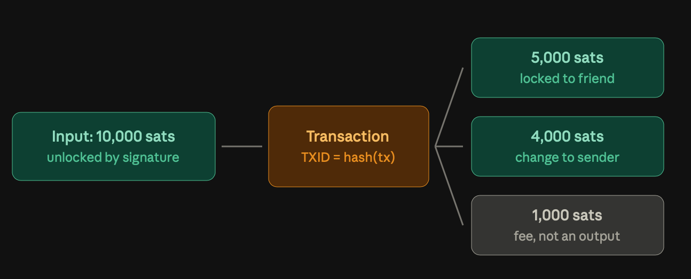
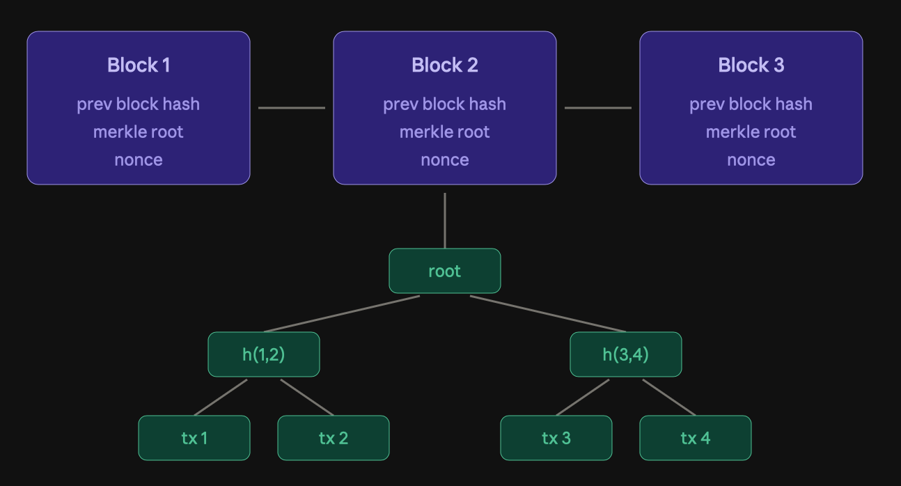
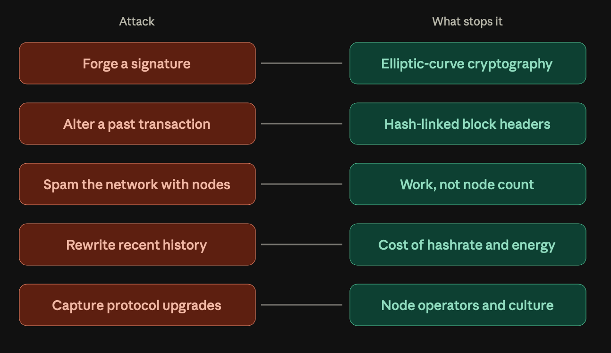
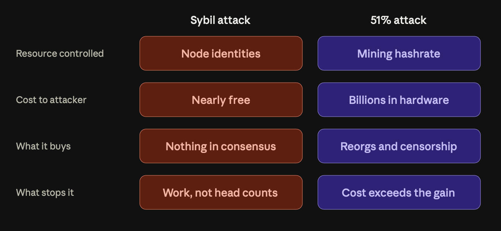
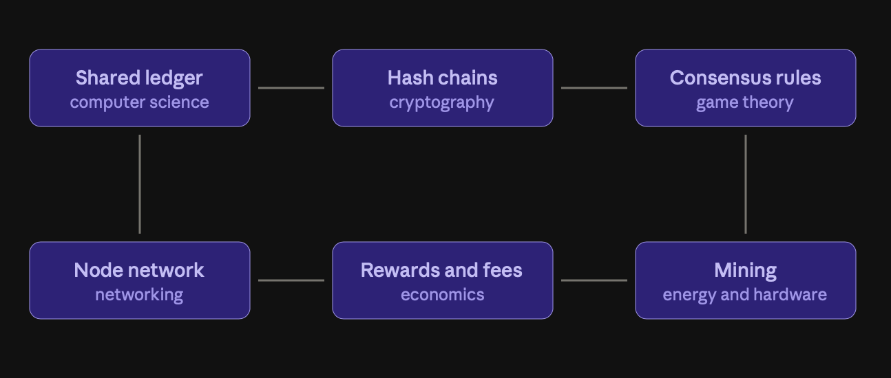

# What Exactly Does It Mean For Bitcoin to be InterDisciplinary?

Two years ago, I made the decision to take the plunge and transition from web development to learning about and building blockchain systems. I took the more popular path and spent about a year contributing to projects built on various Ethereum Layer-2 networks. However, I grew increasingly dissatisfied with the level on which I was playing (the application layer) and decided to switch to lower-level, more protocol-heavy contributions. And what better place to start than with the network that started it all? 

Interestingly, I had read the Bitcoin whitepaper during the pandemic and that event informed my decision to pivot from medicine to software in the first place. So, my pathway to Btrust’s Bitcoin Open Source Fellowship is a homecoming of sorts.

Reading the Bitcoin whitepaper fascinated me and lit a blazing lightbulb in my head. Though I was still non-technical then, I could appreciate what it stood for: using math and code to create a real-world system that was self-governed, decentralized, and incentivized its users to both secure and maintain it. I had never heard of such a system before, especially not on a global scale. 

Furthermore, I was impressed by the sheer ambition of such a project; at its root, Bitcoin is focused on creating a worldwide financial system that simultaneously eliminates trust in a centralized entity and democratises access to its participants, allowing everybody to interact (as users), connect (as node operators), and contribute to it (as developers), regardless of their location, nationality, or net worth.

Perhaps, the most interesting thing about Bitcoin to me is its inter-disciplinary nature. Bitcoin has many moving parts pulled from decades of academic research across multiple fields. These cryptographic primitives, software and network components, and economic and social incentives complement each other and create system-wide checks and balances which ensure no one person or team of people can successfully game or attack the network.

Bitcoin, at its core, is a database of transaction records, or a ledger, created by users who transfer bitcoins from their previous balances to other users, using cryptographically generated addresses. The overarching questions are these:

Firstly, how do we even create these coins in the first place? 
Secondly, how do users trust that senders have the coin amount they claim to and that receivers were actually sent the coin balance they claim to possess?
Most importantly, how can users trust that the entire transaction record can never be tampered with?
Lastly, how do we convince a particular class of users to devote their resources, like time and energy, to secure the entire system.

By dedicated effort and some genius, Satoshi (Bitcoin’s inventor) alongside thousands of open-source contributors have built a system that solves for all these.

Sending transactions over an untrusted environment like the Internet is easy enough if you have a centralized entity that routes requests and maintains the ledger state. That is how most modern financial/banking systems operate, both online and offline. Satoshi took it a step further by introducing decentralization and removing the need for trust in participants of the system.

From the computer science discipline, Satoshi borrowed the idea of a distributed ledger, where any user can maintain a copy of the ledger’s history and current state. This way, they can independently verify transactions and notify other users about invalid transactions. Computer networking is also another major influence on Bitcoin. Users communicate with one another from connected nodes using messages defined by networking protocols like TCP, Bitcoin P2P, and other specialized and supporting protocols like Lightning and Stratum.

However, a shared ledger could still be inaccurate if invalid transactions make it in before a user can confirm them. Bitcoin guards against this by turning to cryptographic as a discipline. For starters, the ledger is secured by linking different transactions together using digital signatures and cryptographic hashes. Moreso, what we know as Bitcoin ‘addresses’ or, more accurately, public keys are really random 256-bit numbers (private keys) that have undergone elliptic-curve math computation, numerous steps of SHA-256 or RIPEMD-160 hashing, and Bech32 encoding.

Under Bitcoin’s Unspent Transaction Output (UTXO) model, users send bitcoins to other users and lock the coins in that transaction output to a script derived from the receiver’s address. This transaction has a unique ID, which is derived by combining hashes of several components of the transaction itself and then hashing this combination. Also, the sender attaches their signature to the transaction, notifying the entire network that they are authorizing the deduction of bitcoin from their account to the receiver’s.

To unlock and spend the coins referenced in a transaction, the receiver must present their public key, the exact transaction ID (TXID) as an input, and a ECDSA or Schnorr signature – the former is what Bitcoin launched with – that tallies to the locking script contained in the input transaction’s output. This creates a new UTXO that sends an amount of bitcoins to other address(es) and the balance to the user’s address as change.

The spender also signs over the hash of this new transaction, creating a cryptographic link consisting of signatures back to the very first recorded transaction. Once a user signs and broadcasts a transaction containing UTXO inputs, it is validated independently by all nodes on the network and they cannot spend any of these UTXOs in a new transaction.

It is standard practice to leave a small portion of coins unaccounted for as transaction fees e.g. if I have a UTXO with 10,000 satoshis (1 BTC equals 100 million satoshis) locked to my public key and I want to send half that amount to my friend, I can lock 5,000 satoshis to their public address in a new UTXO and transfer 4,000 satoshis back to my address. The leftover 1,000 satoshis are claimed by the miner who confirms this transaction as valid, as a way to encourage them to do the work of including their transaction in a new block but we’ll get to that in a bit.

Cryptographic hashes and signatures are notoriously difficult to break or manipulate. Without a user’s private key, it is nigh impossible to forge their signature or unlock the coins sent to their public key. It is also difficult to identify any one user as their activity is hidden behind public keys and hashes. Users do not have to submit personal information before they interact with Bitcoin. Thus, the entire Bitcoin network gains another layer of security and privacy.

Another way cryptography shows up in Bitcoin is in the arrangement of transactions into a merkle tree data structure. Each leaf node in this tree represents a valid transaction and nodes are successively hashed till there is one hash left: the root of the merkle tree. A block consists of all the transactions from this tree and the block header, which includes the merkle root, the current timestamp, the hash of the previous block’s header, the Bitcoin protocol version running on the system of the user assembling the block, the target of the block, and the nonce (more on the last two later).

Merkle trees save memory and time during verification because you need only the merkle root and a couple of intermediate node hashes of the tree to confirm a transaction is really a part of a particular block.

To reiterate, any attempt to forge a transaction falls apart immediately. Any attempt to include an invalid transaction in a block also breaks down immediately. Since each block contains only valid transactions and its header holds the hash of its parent block, the entire blocks of transactions are chained together in a virtually unbreakable chain. Thus, we can surmise that Bitcoin’s ledger holds only valid transactions. This is all easily verifiable public data, hosted across a distributed network and available to any every person on the planet.

At this point, we have answered questions 2 and 3. Let us move on to the last two, introducing two of the interconnected disciplines along the way.

Since we are dealing with a global ledger, users might get updates about new blocks slower than others. They could connect to dishonest or adversarial nodes on the network and download fake data from them, leading to loss of their coin balance. This is a variation of the Byzantine General problem, a popular game theory problem within distributed computing that describes the challenge faced by members of a decentralized system in reaching collective agreement without having a central authority make a decision for them.

Moreover, since Bitcoin is an open system, there is no theoretical limit to the number of nodes that can join the network. So, how does the system ensure that no user can create as many puppet nodes as they want to in order to create and broadcast blocks with invalid transactions containing valid coins to their address? This is called a Sybil attack.

Bitcoin’s Proof-of-Work consensus mechanism prevents both of these untoward scenarios from ever happening, to a very high degree. According to the proof-of-work (PoW) mechanism, to add a new block of verified transactions to the valid chain, a user – called a miner henceforth – must perform a computationally expensive and energy intensive process. This process, called ‘mining’, is resource-hungry because it involves looking for a specific output from the SHA-256 hash function through brute-force trial and error, amounting to between 200 trillion and 400 trillion attempts (hashes) per second.

While mining for new blocks, miners search for a nonce, a ‘number used only once’, which when combined with the other elements of the block header and hashed, results in a hash value that is lower than the target specified in the block header. Miners guess at random numbers to satisfy this requirement because cryptographic hashes change immediately one component of the hash’s preimage (the thing to be hashed) is changed, even the slightest amount.

The probability of finding this nonce is so low that miners would rather abandon their search once another miner finds and broadcasts a valid block nonce and work to create a new block with a new nonce, after validating the newest block, of course. The reverse, validating a block using the broadcasted nonce, is a straightforward and easy procedure.

To incentivize miners to spend this much resources on creating new blocks, the PoW algorithm allows them to include a coinbase transaction that mints new coins to their address as the first transaction in the block. In addition, they collect all the fees included in the block’s transactions as a reward.

This way, miners expend energy to extend AND secure the chain of blocks. In cases where there is a fork or contention in the chain’s history, the PoW algorithm will always accept the chain with the most cumulative proof-of-work. This makes the system Byzantine fault-tolerant as nodes have an easy way of confirming the valid history of the chain at any point.

On the other hand, Proof-of-Work completely eliminates Sybil attacks, which are dependent on the identity of the members of the network i.e. nodes in this case. Since Bitcoin’s consensus depends on PoW, nodes are not counted and an attacker who controls an outsized number of nodes can neither create new blocks nor rewrite the chain’s history.

Another attack vector is the 51% attack, when an attacker has the majority of the mining hashrate on the network (total computational power i.e. the number of cryptographic calculations (hashes) performed per second). Note that this does not necessarily imply a majority of the number of mining nodes as all mining nodes are not equal. 

Theoretically, in that scenario, they could rewrite the chain history by reorganizing recent blocks or double-spending their transactions. They still would be unable to forge signatures, spend others’ coins, or mint outside the prescribed schedule (enforced cryptographic and protocol guardrails). Regardless, It is economically infeasible for this to occur as it would be a massive waste of resources. This is where the discipline of economics shows up.

Suppose a very wealthy malicious actor has the necessary funds to cross the obvious hurdle and purchase the number of mining rigs required for this attack, in tune of tens of billions of dollars. For one, that would be logistically impractical as the global semi-conductor manufacturing industry would have to pause orders from other legitimate customers to produce the chips required by the Application-Specific Integrated Circuits (ASICs) used for Bitcoin mining. Beyond supply chain issues, operational costs like power and storage would heavily discourage anyone from even attempting this. This is how PoW keeps the nodes on Bitcoin’s network, and by extension, its users honest and reliable.

Another important economic concept in Bitcoin is the deflationary property it shares with gold and silver – at least before we start mining asteroids in space. Unlike fiat currency, Bitcoin has a hard limit. Only 21 million coins will ever be minted into existence from the mining process; with 20 million mined already, that leaves less than a million left.

But there’s a catch. The mining reward is not static but is halved every four years. It started as a 50 BTC reward in 2009, dropped to 25 BTC in 2012 and decreased steadily to its current standing at 3.125 at the time of this writing in 2026. It is left to the reader to answer what happens when the last Bitcoin has been minted as a thought exercise.

Our four main questions have been answered. Seemingly unrelated components across vastly different academic fields have been interwoven into a provably robust and attack-resistant global, decentralized financial system.

Computing is the basis of the math and cryptography guarantee the game theoretic consensus mechanism which plays out in mining that secures the distributed ledger hosted across the nodes, which are economically incentivized to connect to and act honestly in the computer network.

Besides the disciplines we discussed, other minor disciplines also surface among participants of the Bitcoin network. Environmental science and engineering are obvious ones as we transition to clean and renewable energy solutions for mining bitcoin. Law and public policy come into play as nation states become actual players in the system, raising questions of identity and regulation.

The social layer of Bitcoin is real and palpable as the nodes are controlled by real people who vote on the proposed upgrades. It is regarded as the last defence because in the worst case scenario of an attack, Bitcoin users can rally and transform the system as they deem fit. In this way, Bitcoin culture is held up as another layer of security against outside threats.

Though the Bitcoin protocol has many moving parts, they all negotiate with each other within a fixed foundation. This is quite different from working on the application layer where there are many shortcuts and developers are able to escape a hard tradeoff by manipulating the base layer. It makes for a tighter, yet more interesting infrastructure.

These are some of the mental models about Bitcoin I am forming in the Btrust Fellowship. We are only two weeks in and I keep encountering new information that updates how I used to think about Bitcoin. One example of that is my realization of the impact that open source has had on Bitcoin. I used to think that Satoshi had to have been a genius or at least a group of people.

Little did I know that the group of people were actually open-source contributors that have built the system into what it is and academic researchers from whom Satoshi borrowed a number of Bitcoin’s primitives and creatively engineered into a truly inventive architecture that ushered in a new age of global finance and collaboration.

  
## REFERENCES

- Nakamoto, S. (2008). _Bitcoin: A Peer-to-Peer Electronic Cash System._ Bitcoin.org. [Bitcoin Whitepaper](https://bitcoin.org/en/bitcoin-paper).
- Antonopoulos, A. M., & Harding, D. A. (2023). _Mastering Bitcoin: Programming the Open Blockchain (3rd ed.)_. [Mastering Bitcoin](https://github.com/bitcoinbook/bitcoinbook).
- Learn Me a Bitcoin. [Learn Me a Bitcoin](https://learnmeabitcoin.com/)
- Arvind Narayanan, Jeremy Clark. _Bitcoin’s Academic Pedigree._ [ACM Queue](https://queue.acm.org/doi/10.1145/3134434.3136559).
- b10c. _“The Incomplete History of Bitcoin Development_”. [b10c.me](https://b10c.me/blog/004-the-incomplete-history-of-bitcoin-development/)
- Hasu. _“The Onion Model of Blockchain Security, Part 1”_. [Deribit Insights](https://insights.deribit.com/market-research/the-onion-model-of-blockchain-security-part-1/)

  
A.I was used for fact-checking and to generate images for this article
